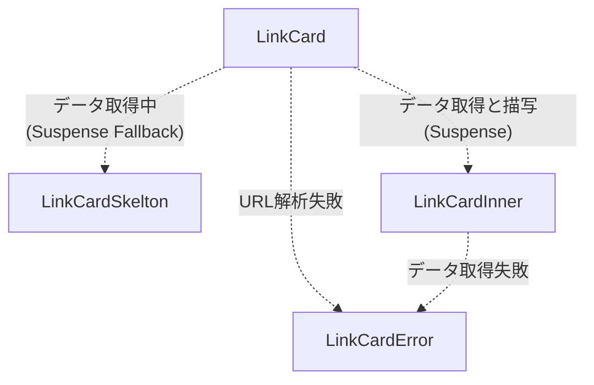

## 目次

## はじめに

下記のような LinkCard を実装しました(当該実装の PR となります)。URL を 1 段落に記載すると、その URL のメタデータを取得してリンクカードとして表示されます。

https://github.com/kanekou/kanekou-blog/pull/66

## ファイル構成

```bash
components/link-card/
├── types
│   └── index.ts
└── views
    ├── index.tsx //LinkCardコンポーネント。メインの呼び出し。
    ├── link-card-error.tsx //LinkCardErrorコンポーネント。データの取得失敗時の描写。
    ├── link-card-inner.tsx //LinkCardInnerコンポーネント。データ取得処理と、取得後の描写。
    └── link-card-skeleton.tsx //LinkCardSkeltonコンポーネント。データ取得中の描写。
```

## コンポーネントの相関図



## 実装内容

主な使用されているコンポーネントを取り上げます。

### PostBody Component

- markdown を表示する Component です。react-markdown を用いて markdown を HTML に変更しています。
- components に自作の LinkCards コンポーネントを指定することで、マークダウンの URL を解析してリンクカードに変換しています。

```jsx:components/post-body.tsx:
import Markdown from "react-markdown";
import rehypeRaw from "rehype-raw";
import remarkGfm from "remark-gfm";
import CodeBlock from "./code-block";

import remarkToc from "remark-toc";
import rehypeSlug from "rehype-slug";
import LinkCard from "./link-card/views";

type Props = {
  content: string;
};

const PostBody = ({ content }: Props) => {
  return (
    <div className="prose mx-auto pb-8">
      <Markdown
        children={content}
        rehypePlugins={[rehypeRaw, rehypeSlug]}
        remarkPlugins={[
          remarkGfm,
          [remarkToc, { maxDepth: 2, heading: "目次" }],
        ]}
        // LinkCard Componentを指定
        components={{ code: CodeBlock, a: LinkCard }}
      />
    </div>
  );
};
export default PostBody;

```

#### LinkCard Component

- リンクカードを表示するメインコンポーネントです。
- ServerComponent を利用することで、非同期処理(async, await)を直感的に記載することができます。呼び出し元は suspense を用いることによりフェッチ中とフェッチ後の描写を行います。
- suspense を利用し、データを取得中はローディング状態としてスケルトン状態のリンクカードを表示するようにしています。データが取得されたのち、LinkCardInner コンポーネント内でリンクカードを描写しています。データ取得処理は LinkCardInner コンポーネント内で記述されています。
- 実装時点では typescript が非同期処理に対応していないため、`ts-ignore`で型チェックを無効化しています
  - https://github.com/vercel/next.js/issues/42292

```jsx:components/link-card/views/index.tsx
import { Suspense } from "react";
import LinkCardInner from "./link-card-inner";
import LinkCardError from "./link-card-error";
import LinkCardSkeleton from "./link-card-skeleton";

type Props = {
  href: string;
  children: string;
};

const LinkCard = ({ children, href }: Props): JSX.Element => {
  if (children === href) {
    const url = new URL(href);
    if (!url) {
      return <LinkCardError href={href} />;
    }

    return (
      <>
        <Suspense fallback={<LinkCardSkeleton />}>
          {/* @ts-ignore Server Component */}
          <LinkCardInner href={url.href} />
        </Suspense>
      </>
    );
  }

  return (
    <a href={href} target="_blank" rel="noreferrer">
      {children}
    </a>
  );
};

export default LinkCard;
```

### linkCardInner Component

- リンクカードの中身を表示するコンポーネント
- データ取得処理もこちらに記載されています。

```jsx:components/link-card/views/link-card-inner.tsx
import getFavicon from "../../../lib/getFavicon";
import getMetaData from "../../../lib/getMetaData";
import LinkCardError from "./link-card-error";

type LinkCardInnerProps = {
  href: string;
};

const LinkCardInner = async ({
  href,
}: LinkCardInnerProps): Promise<JSX.Element> => {
	// データ取得処理
  const meta = await getMetaData(href);
  if (!meta) {
    return <LinkCardError href={href} />;
  }
  const url = new URL(href);
  return (
    <a
      href={href}
      className="flex bg-white border border-gray-200 rounded-lg shadow no-underline"
      target="_blank"
      rel="noreferrer"
    >
      <div className="justify-between p-4 leading-normal overflow-hidden">
        <div className="text-lg font-bold tracking-tight text-gray-900 line-clamp-2">
          {meta.title}
        </div>
        <div className="truncate font-normal text-gray-700">
          {meta.description}
        </div>
        <div className="text-[0.78em] flex mt-2 items-center overflow-hidden whitespace-nowrap">
          
          <span className="text-gray-700 ml-1">{url.hostname}</span>
        </div>
      </div>
      {meta.image && (
        
      )}
    </a>
  );
};

export default LinkCardInner;
```

## 感想

データフェッチ処理は、これまで useEffect を用いて書く必要がありましたが、サーバコンポーネントを用いて簡潔に記載することが可能となりました。useEffect を使用した場合、ステート管理と副作用に気を使う必要がありましたが、それらから解消され直感的に記載できるようになったのはかなり嬉しいポイントだと思います。

## 参考サイト

https://ja.react.dev/reference/rsc/server-components

https://zenn.dev/dl10yr/articles/b49e70fe595c14

https://github.com/y-hiraoka/stin-blog/blob/main/src/components/shared/RichLinkCard.tsx

https://blog.stin.ink/articles/update-blog-site-with-next-app-router
